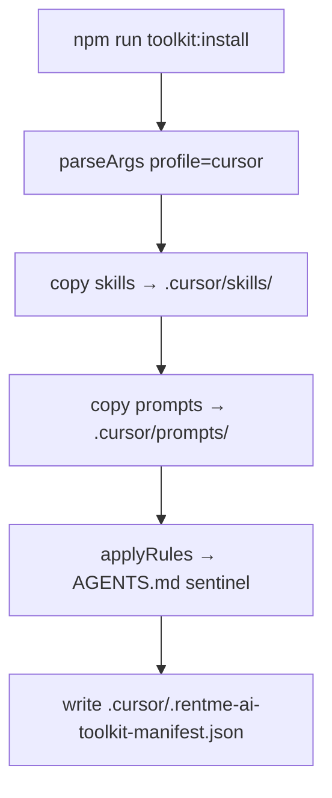

# Plan — @rentme/ai-toolkit (M5L4)

## Struktura paczki

```
packages/rentme-ai-toolkit/
├── package.json              # @rentme/ai-toolkit, publishConfig GH Packages
├── install.mjs               # PROFILES, copy, sentinel, manifest
├── uninstall.mjs             # manifest-driven cleanup
├── README.md                 # PL: local, GH Packages, .npmrc
├── skills/rentme-code-review/SKILL.md
├── rules/team-rules.md
├── prompts/review-pr.md
└── .github/workflows/publish.yml
```

Root repo:

```
.github/workflows/publish-ai-toolkit.yml   # tag ai-toolkit-v*
package.json                               # toolkit:install / toolkit:uninstall
```

## Install flow



## Uninstall flow

1. Odczyt manifestu
2. `rm` każdego pliku z `files[]` (reverse order)
3. Usuń sentinel z `AGENTS.md`
4. Usuń manifest

## Publish workflow

| Trigger                                                | Workflow                                   | Uwagi                                      |
| ------------------------------------------------------ | ------------------------------------------ | ------------------------------------------ |
| Tag `ai-toolkit-v*`                                    | `.github/workflows/publish-ai-toolkit.yml` | semver z tagu / ręczny bump w package.json |
| Push `main` + zmiana w `packages/rentme-ai-toolkit/**` | `packages/.../publish.yml`                 | ciągła publikacja dev                      |

**Permissions:** `packages: write`  
**Secrets:** brak dla maintainera (`GITHUB_TOKEN`); konsumenci: `GH_PKG_TOKEN` w `.npmrc`

## Integracja konsumenta (RentMe root)

```json
"toolkit:install": "node packages/rentme-ai-toolkit/install.mjs",
"toolkit:uninstall": "node packages/rentme-ai-toolkit/uninstall.mjs"
```

Docelowo po remote:

```bash
npm install @rentme/ai-toolkit@0.1.0 --save-dev
npx --no-install node node_modules/@rentme/ai-toolkit/install.mjs
```

## Weryfikacja

1. `npm run toolkit:install` — exit 0, log `✓ skill`, `✓ manifest`
2. Sprawdź `.cursor/skills/rentme-code-review/SKILL.md` istnieje
3. Sprawdź `AGENTS.md` zawiera `BEGIN @rentme/ai-toolkit`
4. `npm run toolkit:uninstall` — pliki usunięte, sentinel zniknięty
5. Ponowny install — idempotentny (replace sentinel)

## Ryzyka

| Ryzyko                       | Mitygacja                                                          |
| ---------------------------- | ------------------------------------------------------------------ |
| Kolizja z `10x-cli` sentinel | Osobne markery `@przeprogramowani/10x-cli` vs `@rentme/ai-toolkit` |
| Publish bez remote           | Workflow gotowy; pierwszy publish po `git remote add`              |
| Windows path                 | `relative().replace(/\\/g, '/')` w manifeście                      |
