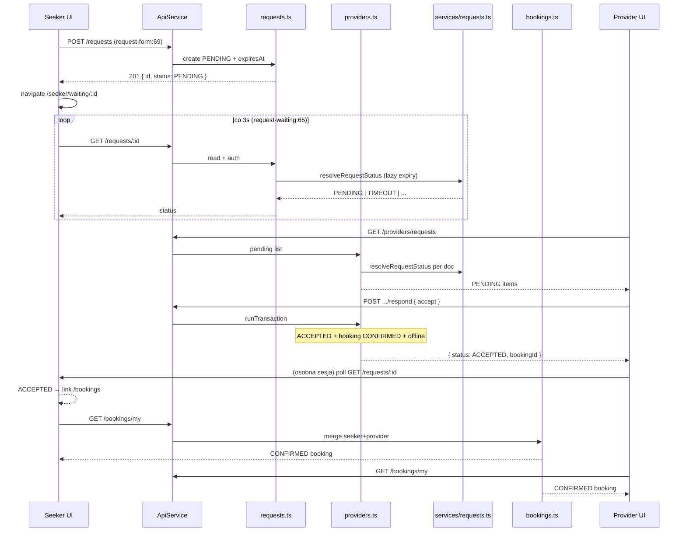

# Research — provider accept booking flow (S-06)

**Cel jednolinijkowy:** Prześledzić i udokumentować pionowy slice seeker request → provider respond (accept/decline/timeout) → booking `CONFIRMED`, bo `repo-map.md` wskazał ten przepływ jako gwiazdę przewodnią łączącą wszystkie strefy ryzyka (tx Firestore, JWT, scheduler, guardy).

---

## 1. Feature overview

### 1.1 E2E trace — happy path (accept)

| Krok | Warstwa      | Plik:linia                              | Akcja                                                                            | Etykieta     |
| ---- | ------------ | --------------------------------------- | -------------------------------------------------------------------------------- | ------------ |
| 1    | UI seeker    | `request-form.component.ts:65-72`       | `submit()` → `api.createRequest()` → navigate `/seeker/waiting/:id`              | **evidence** |
| 2    | API          | `api.service.ts:125-130`                | `POST /requests` `{ providerId, categoryId, message }`                           | **evidence** |
| 3    | Backend      | `requests.ts:10-51`                     | Walidacja online + kategoria; `status: PENDING`, `expiresAt: requestExpiresAt()` | **evidence** |
| 4    | UI seeker    | `request-waiting.component.ts:62-66`    | `poll()` co 3 s + timer 1 s z `expiresAt`                                        | **evidence** |
| 5    | API          | `api.service.ts:133-134`                | `GET /requests/:id`                                                              | **evidence** |
| 6    | Backend      | `requests.ts:71-84`                     | Autoryzacja seeker/provider; `resolveRequestStatus()` (lazy expiry)              | **evidence** |
| 7    | UI provider  | `provider-requests.component.ts:55-57`  | `load()` + `setInterval` 5 s — lista PENDING                                     | **evidence** |
| 8    | API          | `api.service.ts:117-118`                | `GET /providers/requests`                                                        | **evidence** |
| 9    | Backend      | `providers.ts:78-94`                    | Query PENDING; filtr po `resolveRequestStatus`                                   | **evidence** |
| 10   | UI provider  | `provider-requests.component.ts:66-71`  | `respond(id, 'accept')` → `api.respondToRequest()`                               | **evidence** |
| 11   | API          | `api.service.ts:121-122`                | `POST /providers/requests/:id/respond` `{ action: 'accept' }`                    | **evidence** |
| 12   | Backend      | `providers.ts:118-177`                  | `runTransaction`: ACCEPTED + `bookings` doc CONFIRMED + `isOnline: false`        | **evidence** |
| 13   | Backend      | `providers.ts:168-172`                  | `recalcCategoryOnlineCounts()` poza tx (best-effort)                             | **evidence** |
| 14   | UI provider  | `provider-requests.component.ts:69-71`  | Toast + `router.navigate(['/bookings'])`                                         | **evidence** |
| 15   | UI seeker    | `request-waiting.component.ts:79-82`    | Poll wykrywa ACCEPTED → toast + link `/bookings`                                 | **evidence** |
| 16   | API          | `api.service.ts:141-142`                | `GET /bookings/my`                                                               | **evidence** |
| 17   | Backend      | `bookings.ts:9-26`                      | Merge seeker + provider queries, sort `createdAt`                                | **evidence** |
| 18   | UI obie role | `bookings-list.component.ts` (ngOnInit) | `getMyBookings()` — tag `CONFIRMED`                                              | **evidence** |

### 1.2 E2E trace — decline

| Krok | Plik:linia                             | Wynik                                 | Etykieta     |
| ---- | -------------------------------------- | ------------------------------------- | ------------ |
| 10′  | `provider-requests.component.ts:66-74` | `action: 'decline'`                   | **evidence** |
| 12′  | `providers.ts:139-141`                 | Tx: `status: DECLINED`, brak bookingu | **evidence** |
| 15′  | `request-waiting.component.ts:83-84`   | Poll → toast „Odrzucono”              | **evidence** |

### 1.3 E2E trace — timeout

| Ścieżka                  | Plik:linia                                      | Mechanizm                                           | Etykieta                                   |
| ------------------------ | ----------------------------------------------- | --------------------------------------------------- | ------------------------------------------ |
| Lazy (poll)              | `services/requests.ts:41-49`                    | `resolveRequestStatus` → `expirePendingRequest`     | **evidence**                               |
| Respond guard            | `providers.ts:134-137`                          | W tx: jeśli `expiresAt <= now` → TIMEOUT + HTTP 410 | **evidence**                               |
| Scheduler                | `index.ts:12-19` → `expireStalePendingRequests` | Co 1 min, limit 100, per-doc tx                     | **evidence**                               |
| UI seeker                | `request-waiting.component.ts:85-86`            | Toast „Czas minął” po statusie TIMEOUT              | **evidence**                               |
| Lag schedulera           | —                                               | Do ~60 s po `expiresAt` zanim scheduler odpali      | **inference** (schedule `every 1 minutes`) |
| Brak bookingu po TIMEOUT | `providers.ts:134-137`                          | Accept po expiry → 410, nie tworzy bookingu         | **evidence**                               |

### 1.4 Diagram sekwencji (accept)



### 1.5 Nieznane / wymaga weryfikacji manualnej

| #   | Pytanie                                                                                                       | Etykieta                                                            |
| --- | ------------------------------------------------------------------------------------------------------------- | ------------------------------------------------------------------- |
| 1   | Czy seeker zawsze widzi booking w tej samej sekundzie co provider po accept? (brak realtime — tylko poll 3 s) | **unknown** — zależy od timingu poll                                |
| 2   | Zachowanie przy double-click „Akceptuj” (dwa równoległe POST respond)                                         | **inference** — drugi powinien dostać 409 NOT_PENDING (tx re-check) |
| 3   | Pełny E2E z creds Firebase — spec istnieje, run niezweryfikowany                                              | **unknown** — blocker `E2E_*` env                                   |

---

## 2. Technical debt

### 2.1 Luki testowe

| Obszar                                      | Stan                                         | Ryzyko (test-plan)     | Etykieta                                          |
| ------------------------------------------- | -------------------------------------------- | ---------------------- | ------------------------------------------------- |
| `expirePendingRequest` / lazy expiry        | ✅ 9 testów Vitest `requests.test.ts` (R-04) | TIMEOUT na read-path   | **evidence**                                      |
| `POST .../respond` accept/decline/timeout   | ❌ brak unit/harness                         | R-01, R-02, R-06, R-10 | **evidence** (grep: brak `respond` w `*.test.ts`) |
| Race accept vs expire w ostatniej sekundzie | ❌ brak testu integracyjnego                 | R-01                   | **inference**                                     |
| E2E `accept-booking.spec.ts`                | ✅ scaffold; **SKIP** bez creds              | R-01, R-03             | **evidence** (`e2e/accept-booking.spec.ts:12`)    |
| `request-waiting` polling                   | ❌ brak unit z mock API                      | R-04 (UI)              | **evidence**                                      |
| `provider-accept-booking` phase 3 manual    | ⏳ pending                                   | MVP §7 kroki 3–5       | **evidence** (`pending-backlog.md`)               |

### 2.2 Blast radius — pliki zmieniające się razem

**Git co-change** (ostatnie commity dotykające slice):

| Commit                      | Pliki współzmieniane                                                                                     |
| --------------------------- | -------------------------------------------------------------------------------------------------------- |
| `0bfb66f` (baseline)        | `providers.ts`, `services/requests.ts`, `provider-requests.component.ts`, `request-waiting.component.ts` |
| `6840234` (phase 2)         | `provider-requests.component.ts`                                                                         |
| `a92e190` (timeout phase 1) | `services/requests.ts`                                                                                   |
| `d117768` (merge)           | `services/requests.ts`                                                                                   |

**Statyczne importy (coupling):**

```
provider-requests.component.ts
  → api.service.ts (respondToRequest, getPendingRequests)
  → functions/routes/providers.ts (POST respond)

request-waiting.component.ts
  → api.service.ts (getRequest)
  → functions/routes/requests.ts (GET :id)
  → services/requests.ts (resolveRequestStatus via route)

providers.ts
  → services/requests.ts (resolveRequestStatus)
  → services/provider.ts (recalcCategoryOnlineCounts)
  → db.ts (runTransaction)
```

Zmiana kontraktu respond (`action`, kody HTTP, kształt odpowiedzi) wymaga synchronizacji: **1 komponent Angular + 1 metoda ApiService + 1 handler Express** — minimum 3 pliki.

### 2.3 Connascence / coupling

| Typ                     | Opis                                                             | Pliki                                              | Prawdziwy dług?                                                          |
| ----------------------- | ---------------------------------------------------------------- | -------------------------------------------------- | ------------------------------------------------------------------------ |
| **Auth JWT**            | `requireAuth` na wszystkich trasach domenowych; `req.uid` w tx   | `middleware/auth.ts`, wszystkie `routes/*`         | Nie — konwencja projektu                                                 |
| **Firestore tx**        | Respond i expire dzielą wzorzec re-check `PENDING` + `expiresAt` | `providers.ts:128-137`, `requests.ts:10-16`        | Częściowo — logika timeout zduplikowana w dwóch tx (akceptowalne na MVP) |
| **Timeout scheduler**   | Dual-path: scheduler + lazy read + inline check w respond        | `index.ts`, `services/requests.ts`, `providers.ts` | Tak — trzy miejsca muszą zgadzać się co do `REQUEST_TIMEOUT_MS`          |
| **Offline side-effect** | Accept ustawia `isOnline: false` w tej samej tx co booking       | `providers.ts:157-158`                             | Nie — reguła biznesowa MVP                                               |
| **recalc poza tx**      | `recalcCategoryOnlineCounts` po respond — failure tylko log      | `providers.ts:168-172`                             | Niski — counts mogą być chwilowo nieaktualne                             |
| **Polling bez backoff** | Seeker 3 s, provider 5 s — stałe interwały                       | `request-waiting:65`, `provider-requests:57`       | Niski na MVP scale                                                       |

### 2.4 Hotspoty (złożoność × częstotliwość zmian)

| Hotspot                        | LOC / złożoność             | Częstotliwość (git)      | Uwagi                         |
| ------------------------------ | --------------------------- | ------------------------ | ----------------------------- |
| `providers.ts` POST respond    | Tx 50+ linii, 4 kody błędów | Wysoka (S-06, phase 1–2) | Największy blast radius       |
| `services/requests.ts`         | 3 ścieżki expiry            | Wysoka (S-05 + S-06)     | Współdzielony z timeout slice |
| `request-waiting.component.ts` | Poll + timer + 4 statusy UI | Średnia                  | UX krytyczny dla R-03/R-04    |
| `api.service.ts`               | Centralny kontrakt HTTP     | Średnia                  | Każdy nowy endpoint dotyka    |

### 2.5 Prawdziwy dług vs coupling łapany przez CI

| Mechaniczne (CI/hooks)                      | Prawdziwy dług (wymaga świadomej pracy)                         |
| ------------------------------------------- | --------------------------------------------------------------- |
| Prettier + `tsc --noEmit` (lefthook, hooks) | Brak testów respond accept/decline/race (R-01, R-02)            |
| Vitest R-04 tylko dla expiry service        | E2E north star niezweryfikowany z creds (R-03)                  |
| Build Angular + Functions w CI              | Phase 3 manual MVP §7 niezamknięta → roadmap S-06 `in-progress` |
| `role.guard.spec.ts` — izolacja stref       | Brak harnessu transakcji respond (test-plan P0)                 |

---

## 3. Structural claims (do weryfikacji)

| #   | Claim                                                                                                                   | Oczekiwany wynik                               |
| --- | ----------------------------------------------------------------------------------------------------------------------- | ---------------------------------------------- |
| C1  | W Angular istnieje **dokładnie jedno** miejsce wywołania `respondToRequest` (poza definicją w ApiService)               | 1 call site w `provider-requests.component.ts` |
| C2  | `runTransaction` w `functions/src` występuje w **dwóch** plikach produkcyjnych: `providers.ts` i `services/requests.ts` | 2 pliki, 2 call sites                          |
| C3  | `expirePendingRequest` jest wywoływane z **dwóch** miejsc w `services/requests.ts` (scheduler loop + lazy resolve)      | 2 internal call sites + 1 export               |
| C4  | Endpoint respond jest zarejestrowany tylko pod `/api/providers/requests/:id/respond`                                    | 1 route handler w `providers.ts`               |
| C5  | `request-waiting` nie wywołuje respond — tylko read                                                                     | 0 respond w seeker feature                     |

---

## 4. Structural verification (ast-grep)

**Status narzędzia:** `@ast-grep/cli@0.44.1` — `npm i -D` zakończone, ale **binarka niedostępna na Windows** (`npx @ast-grep/cli` → `could not determine executable`; brak `node_modules/@ast-grep/cli` po postinstall). Weryfikacja przez **ripgrep** — ograniczenie: brak parsowania AST (np. nie odróżnia komentarzy od kodu).

| Claim | Metoda                                   | Wynik                                                                                        | Werdykt                |
| ----- | ---------------------------------------- | -------------------------------------------------------------------------------------------- | ---------------------- |
| C1    | `rg respondToRequest src/`               | 2 dopasowania: definicja `api.service.ts:121`, wywołanie `provider-requests.component.ts:67` | **confirmed**          |
| C2    | `rg runTransaction functions/src/`       | `providers.ts:128`, `services/requests.ts:10` (+ mock w `requests.test.ts`)                  | **confirmed** (2 prod) |
| C3    | `rg expirePendingRequest functions/src/` | Definicja `:8`; wywołania `:31` (scheduler), `:46` (resolve); import test `:6`               | **confirmed**          |
| C4    | `rg "requests/:id/respond" functions/`   | Jedyny handler `providers.ts:118`                                                            | **confirmed**          |
| C5    | `rg respond src/app/features/seeker/`    | 0 wyników (tylko provider ma `respond()`)                                                    | **confirmed**          |

**Refined:** Claim C1 — w szablonie HTML providera są `(onClick)="respond(r.id, ...)"` (2 bindingi), ale **jeden** call chain do API (`respond()` → `respondToRequest`).

---

## 5. Rekomendacje (bez implementacji — M4L3)

1. **P0 testy** — harness Vitest dla `POST .../respond` (accept, decline, 410 timeout, 409 NOT_PENDING, 403 FORBIDDEN) — `test-plan.md` R-01/R-02.
2. **Odblokuj E2E creds** — jedyny test end-to-end north star jest SKIP.
3. **Zamknij phase 3** — manual checklist w `provider-accept-booking/plan.md` → roadmap S-06 `done`.
4. **Architect path** — L4 plan / L5 domain (per `pending-backlog.md`) pozostają na później.

---

## Powiązane artefakty

- `context/map/repo-map.md` — anchor M4L2/M4L3
- `context/changes/provider-accept-booking/` — implementacja (phase 1–2 ✅)
- `context/changes/request-timeout-expiry/research.md` — dual-path expiry (S-05)
- `context/foundation/test-plan.md` — macierz ryzyk R-01…R-04
