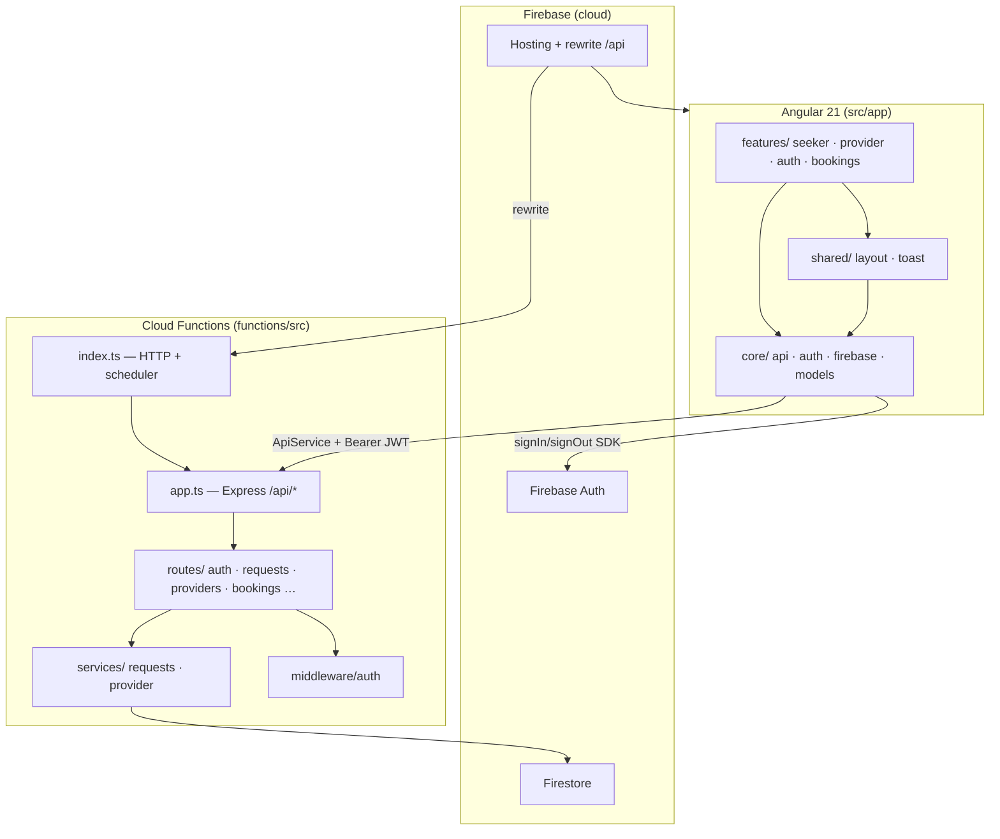

# Repo map — RentMe 2.0

> Synteza: [`artifact-1-territory.md`](artifact-1-territory.md) · [`artifact-2-structure.md`](artifact-2-structure.md) · [`artifact-3-contributors.md`](artifact-3-contributors.md)  
> Data mapy: 2026-07-12 · Moduł 4 Lekcja 2 (Architect path)

---

## 1. TL;DR

RentMe 2.0 to **marketplace usług on-demand** (seeker ↔ provider): **Angular 21** po stronie klienta, **Firebase Auth + Cloud Functions (Express)** po stronie API, Firestore tylko server-side. Repo jest **młode** (7 commitów, jeden dzień historii) — cała aktywność to intensywny sprint kursu 10xDevs z równoległymi slice'ami M2L5 (timeout requestów, accept booking). Najgorętszy kod: `functions/src/routes|services` i `src/app/features/seeker|provider` + `src/app/core/auth`. Dokumentacja `context/` jest równie aktywna jak kod aplikacji. Graf importów (madge) **bez cykli**; coupling klient–serwer przez `ApiService` ↔ `/api/*`. Właściciel: **Miroslaw Moskalik** (+ agent Cursor na implementacji slice'ów). Główne strefy ryzyka: auth/role guard, race accept booking, scheduler expiry + indeks Firestore, deploy Firebase, brak pełnego E2E z creds.

### Diagram warstw

---

## 2. Teren — rdzeń vs peryferia

| Klasa               | Ścieżki                                                                                | Aktywność git                  | Rola                      |
| ------------------- | -------------------------------------------------------------------------------------- | ------------------------------ | ------------------------- |
| **Rdzeń domenowy**  | `functions/src/routes/`, `functions/src/services/`, `src/app/features/`                | routes 9, seeker 5, provider 4 | logika biznesowa MVP      |
| **Rdzeń platformy** | `src/app/core/api/`, `src/app/core/auth/`, `functions/src/middleware/auth.ts`          | auth 8 dotknięć w core         | HTTP, guards, tokeny      |
| **Rdzeń infra**     | `firebase.json`, `firestore.rules`, `firestore.indexes.json`, `functions/src/index.ts` | indexes 2×                     | deploy, scheduler, reguły |
| **Aktywne meta**    | `context/`, `.cursor/`                                                                 | 72 + 38                        | PRD, plany, reguły agenta |
| **Peryferia**       | `public/`, `scripts/setup-*`, `.vscode/`                                               | 1–9                            | setup, IDE                |
| **Rosnące**         | `e2e/`                                                                                 | 7                              | Playwright M3L4           |

**Rdzeń operacyjny** = wszystko w diagramie powyżej. **Peryferia** = skrypty jednorazowego setupu i assety statyczne.

---

## 3. Realne powiązania (coupling)

| Połączenie                                     | Typ             | Dowód                                                    |
| ---------------------------------------------- | --------------- | -------------------------------------------------------- |
| `features/*` → `core/api`                      | import TS       | każdy ekran domenowy używa `ApiService`                  |
| `core/api` → Cloud Functions                   | HTTP runtime    | `environment.apiUrl` + `/api/requests` itd.              |
| `routes/providers` ↔ `services/requests`       | commit + import | accept/decline w jednej transakcji; co-change 3×         |
| `services/requests` ↔ `firestore.indexes.json` | deploy coupling | query `status+expiresAt` w schedulerze                   |
| `AuthService` ↔ `middleware/auth`              | JWT             | klient SDK, serwer `verifyIdToken`                       |
| `context/changes/*` ↔ kod                      | proces          | slice planowany przed implementacją w tym samym commicie |

**Granice warstw Angular:** zachowane (brak feature→feature, brak Firestore w komponentach). **Functions:** routes→services jednokierunkowo, brak cykli (madge).

---

## 4. Strefy ryzyka (4–6)

| #   | Strefa                       | Ryzyko                                                   | Gdzie szukać                                                           |
| --- | ---------------------------- | -------------------------------------------------------- | ---------------------------------------------------------------------- |
| 1   | **Auth & role switch**       | SEEKER na `/provider` lub odwrotnie; `activeRole` desync | `role.guard.ts`, `functions/src/routes/auth.ts`, R-07 w `test-plan.md` |
| 2   | **Request timeout / expiry** | scheduler nie wygasa → wiszące PENDING; brak indeksu     | `services/requests.ts`, `firestore.indexes.json`, R-04                 |
| 3   | **Accept race**              | podwójny accept → duplikat booking                       | `routes/providers.ts` transakcja; R-01/R-02                            |
| 4   | **Firebase deploy**          | indeks/rules nie wdrożone → prod 500                     | `context/deployment/deployment-result.md`, `firebase deploy`           |
| 5   | **API error shape**          | `{ error: string }` vs połykane błędy                    | `AGENTS.md`, M3L5 pending audit `functions/src/`                       |
| 6   | **E2E bez creds**            | krytyczne flow niezweryfikowane end-to-end               | `e2e/README.md`, `pending-backlog.md` blocker                          |

---

## 5. Kogo zapytać

| Temat                           | Kontakt                                     | Uwagi                               |
| ------------------------------- | ------------------------------------------- | ----------------------------------- |
| Wszystko produkt + architektura | **Miroslaw Moskalik** (owner)               | jedyny autor ludzki                 |
| Historia slice'ów M2L5          | commity `RentMe Agent` + `context/changes/` | agent — nie „osoba”, ale ślad w git |
| Deploy prod                     | owner + `context/deployment/`               | prod: rentme-b5e34.web.app          |
| Reguły agenta / hooki           | owner + `.cursor/rules/`                    | M3L3 quality gates                  |

**Brak zespołu** — kolumna „kogo zapytać” = właściciel repo we wszystkich wierszach.

---

## 6. Pierwszy dzień — pliki do przeczytania (5–8)

| #   | Plik                                 | Dlaczego                                      |
| --- | ------------------------------------ | --------------------------------------------- |
| 1   | `AGENTS.md`                          | twarde reguły projektu, onboarding agenta     |
| 2   | `context/foundation/prd.md`          | kontrakt MVP (FR-001…FR-008)                  |
| 3   | `src/app/app.routes.ts`              | mapa tras i ról seeker/provider               |
| 4   | `src/app/core/api/api.service.ts`    | cały kontrakt HTTP klienta                    |
| 5   | `functions/src/app.ts`               | mount API + CORS                              |
| 6   | `functions/src/routes/providers.ts`  | accept/decline — najbardziej krytyczna logika |
| 7   | `functions/src/services/requests.ts` | timeout, expiry, scheduler                    |
| 8   | `context/foundation/test-plan.md`    | ryzyka R-01…R-10 i fazy testów                |

---

## 7. Ograniczenia tej mapy

| Ograniczenie                                 | Wpływ                                                                |
| -------------------------------------------- | -------------------------------------------------------------------- |
| **Młoda historia git** (7 commitów, 1 dzień) | brak trendów kwartalnych; hot spoty = cała baza                      |
| **madge + lazy routes**                      | graf statyczny nie widzi dynamicznych `import()`                     |
| **Brak remote / gh**                         | nie mapowano PR review ani CI history na GitHubie                    |
| **Solo dev**                                 | ownership table uproszczona                                          |
| **Firestore rules**                          | nie audytowane statycznie w tym artefakcie                           |
| **Runtime Firebase**                         | coupling emulator vs cloud wymaga ręcznej weryfikacji `useEmulators` |

---

## Mission Log — M4L2 checklist

- [x] `context/map/` utworzone
- [x] `artifact-1-territory.md` — git wide scan z dowodami
- [x] `artifact-2-structure.md` — madge + analiza warstw
- [x] `artifact-3-contributors.md` — autorzy per strefa
- [x] `repo-map.md` — synteza 7 sekcji
- [x] Link w README context
- [x] `pending-backlog.md` zaktualizowany
- [ ] Commit: `docs: M4L2 add context/map repo-map and artifacts`

**Architect path — pozostałe artefakty:** M4L5 domain
